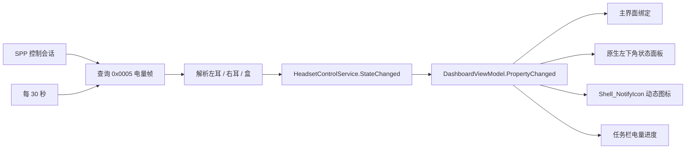
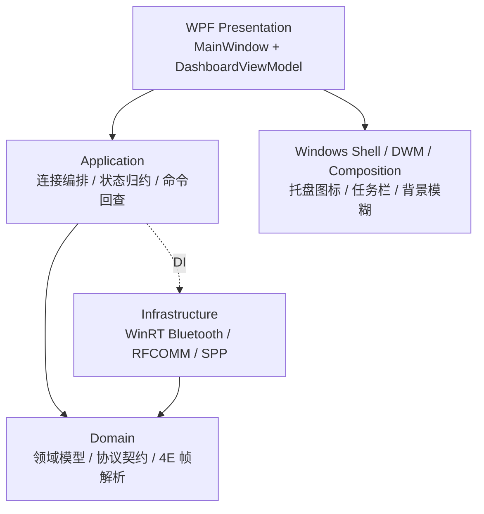
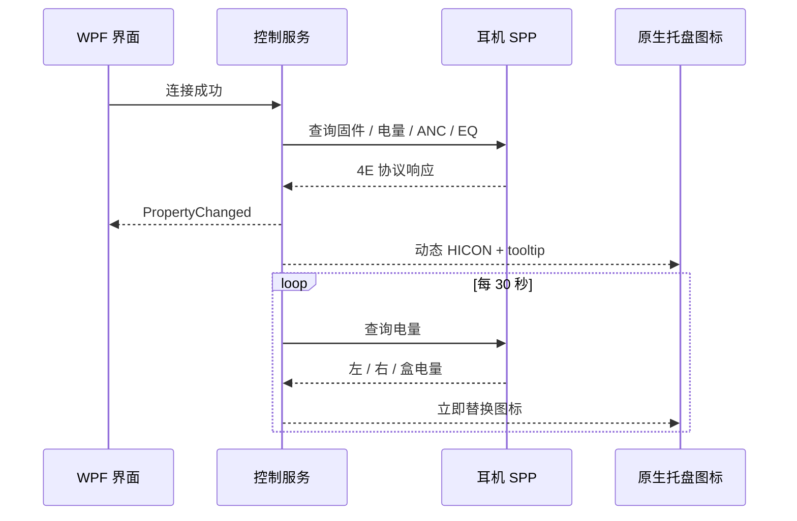
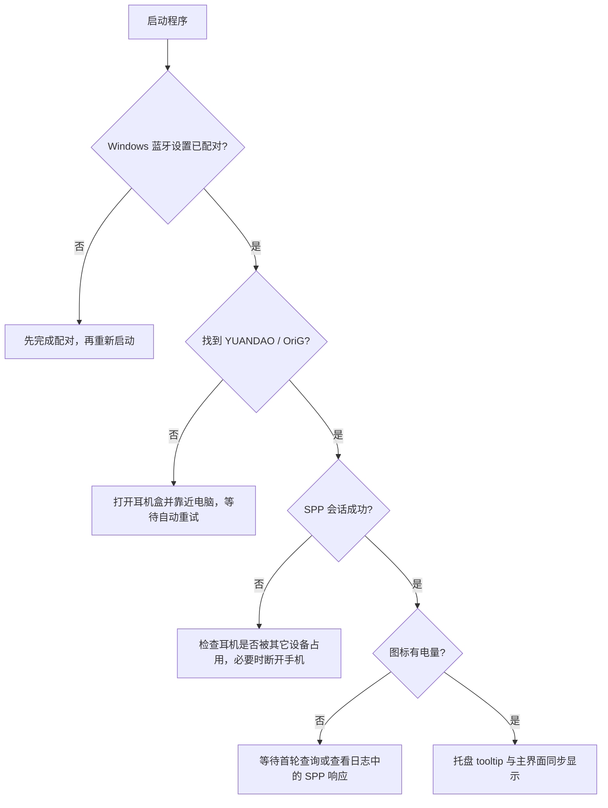

# NICEHCK OriG-in

<div align="center">

## 原道「原点」TWS Windows 控制中心

一款面向 Windows 的原生桌面工具：连接耳机、查看三路电量、识别充电状态，并控制 ANC / EQ 与常用开关。

[](https://dotnet.microsoft.com/)
[](https://www.microsoft.com/windows)
[](https://github.com/Fat-kevin/NICEHCK_OriG-in)
[](https://www.bluetooth.com/)

</div>

<div align="center">

**不是 WebView，不是浏览器套壳，也不是 CPU 截图伪造的玻璃窗口。**

WPF + WinRT 蓝牙 + 原生 Win32 Shell / DWM / Composition，保持普通 Windows 窗口的启动速度、交互和资源占用。

</div>

---

## 项目速览

| 项目 | 当前实现 |
| --- | --- |
| 生产入口 | `src/YuandaoTws.Desktop` |
| 调试入口 | `src/YuandaoTws.App` |
| 目标系统 | Windows 10/11 x64 |
| 控制通道 | 经典蓝牙 RFCOMM / SPP |
| 控制协议 | NiceHCK / BES `0x4E` 帧 |
| UI | C# / .NET 8 / WPF / MVVM |
| 桌面集成 | 原生 `Shell_NotifyIcon`、任务栏电量进度、Win32 状态面板 |
| 状态更新 | 连接后立即查询，电量默认每 30 秒查询一次；收到设备数据即刷新 UI |
| 发布方式 | GitHub Release 提供安装 EXE、便携版和诊断工具版 |

## 设备资产

<div align="center">
<table>
<tr>
<td align="center"><br />左耳</td>
<td align="center"><br />右耳</td>
<td align="center"><br />充电盒</td>
</tr>
</table>
</div>

## 能做什么

| 模块 | 能力 | 状态 |
| --- | --- | :---: |
| 自动连接 | 扫描已配对的 `YUANDAO` / `OriG` 设备，发现后自动建立 SPP，会话断开后自动重连 | ✅ |
| 电量 | 左耳、右耳、充电盒独立显示；未知值显示 `—`，不把未知伪装成 0% | ✅ |
| 充电 | 左右耳充电标志、充电盒充电标志；用绿色闪电区分正在充电 | ✅ |
| 降噪 | 关闭、通透、普通、深度、试验、风噪抑制六态模式 | ✅ |
| 均衡器 | 七档中文 EQ 预设 | ✅ |
| 快捷开关 | 游戏模式、低延迟、双设备、入耳检测、抗风噪 | ✅ |
| 桌面常驻 | 原生通知区域电量图标、精确 tooltip、右键 ANC 菜单、左下角状态面板 | ✅ |
| 窗口效果 | Windows Composition / DWM 背景采样与模糊，不依赖浏览器渲染 | ✅ |
| 调试能力 | GATT / SPP 探测、协议验证、会话记录 | 🧰 |

## 实时电量是怎么更新的？

任务栏通知区域里的小图标不是静态图片：



- 连接成功后先做一次完整状态查询，避免图标刚启动时显示空数据。
- 电量默认每 30 秒重新查询一次；收到新的协议响应后立即更新，不需要重启程序。
- 图标两根蓝色电池柱分别代表左耳和右耳，充电时叠加绿色闪电。
- 鼠标悬停 tooltip 会给出精确百分比，例如：`原点耳机 · 左耳 60% · 右耳 70%`。
- 断开连接后清理旧的充电标志和电量，图标切换为“等待连接/正在连接”，不会继续假装在线。

> 这里的“实时”是设备协议允许范围内的实时：设备没有主动推送电量时，软件通过 30 秒 SPP 查询保持同步；系统不会凭空推测电量。

## 原生 Windows 设计





## 协议关键点

正式控制通道不是 GATT，而是经典蓝牙 RFCOMM / SPP：

```text
0000a100-1000-8000-4e48-434b4354524c
```

协议适配器将品牌差异隔离在 `YuandaoProtocol`，上层只接触领域模型。控制命令统一走“写入 → 等待设备处理 → 查询回读 → UI 确认”：

```text
┌────────────┐     ┌──────────────┐     ┌────────────┐
│ 用户操作    │ ──> │ SPP 设置命令  │ ──> │ 设备处理    │
└────────────┘     └──────────────┘     └─────┬──────┘
                                               │ 100 ms
                         ┌─────────────────────▼──────┐
                         │ 查询回读，使用设备真实状态 │
                         └────────────────────────────┘
```

这样做可以避免“按钮变蓝了，但耳机其实没有切换”的假成功状态。

## 下载正式版本

最新版本：**[v0.1.1](https://github.com/Fat-kevin/NICEHCK_OriG-in/releases/tag/v0.1.1)**

| 下载包 | 适合谁 | 依赖 |
| --- | --- | --- |
| `YuandaoTws-Setup-v0.1.1.exe` | **推荐；正式安装版**，支持卸载和快捷方式 | 不需要安装 .NET |
| `YuandaoTws-Desktop-v0.1.1-win-x64-portable.zip` | 不想安装、需要放在 U 盘或自定义目录 | 不需要安装 .NET |
| `YuandaoTws-Inspector-v0.1.1-win-x64-standalone.zip` | 协议探测、SPP/GATT 调试和日志采集 | 不需要安装 .NET |
| `SHA256SUMS.txt` | 校验下载完整性 | Windows PowerShell / `certutil` |

### 推荐安装方式

1. 下载并运行 `YuandaoTws-Setup-v0.1.1.exe`。
2. 选择安装目录，按向导完成安装；可选创建桌面快捷方式。
3. 从开始菜单或桌面快捷方式启动“原点耳机控制”。
4. 首次运行前，先在 Windows 蓝牙设置中完成耳机配对。

安装程序会注册 Windows 卸载入口；升级时直接运行新版本安装程序即可。若不想写入系统安装目录，可下载 portable 压缩包，解压后运行其中的 `YuandaoTws.Desktop.exe`。

> Windows SmartScreen 可能会对个人签名的未签名 EXE 显示提示，这是发布者证书信誉问题，不代表程序被浏览器套壳或包含 WebView。

## 安装、构建与运行

### 使用条件

- Windows 10/11 x64
- 开发构建需要 .NET 8 SDK；发布版可使用自包含 EXE
- 可用蓝牙适配器
- 首次运行前，先在“设置 → 蓝牙和设备”中完成耳机配对

### 开发运行

```powershell
dotnet restore
dotnet build
dotnet test tests/YuandaoTws.Domain.Tests
dotnet run --project src/YuandaoTws.Desktop
```

也可以双击根目录的：

```text
启动耳机控制台.bat
```

它会结束旧的生产版实例、构建并启动 `YuandaoTws.Desktop`。如果构建提示 DLL 被占用，先退出旧程序再运行脚本。

### 发布单文件

```powershell
dotnet publish src/YuandaoTws.Desktop `
  -c Release `
  -r win-x64 `
  --self-contained true `
  /p:PublishSingleFile=true `
  /p:EnableMsixTooling=true `
  /p:DebugType=None
```

输出是可直接复制到其它 Windows 机器的自包含 EXE。由于 Win2D/Windows App SDK 的资源要求，单文件发布会启用 `EnableMsixTooling`；程序仍然是普通 WPF HWND，不会变成 MSIX 或浏览器应用。正式安装器脚本位于 `installer/YuandaoTws.iss`。

## 项目结构

```text
src/
├── YuandaoTws.Domain/          纯 C# 领域模型、协议契约和解析器
├── YuandaoTws.Application/     连接编排、状态流、控制命令和回查
├── YuandaoTws.Infrastructure/  WinRT 蓝牙、RFCOMM、SPP 和协议适配器
├── YuandaoTws.Desktop/         WPF 生产版、原生托盘和桌面集成
├── YuandaoTws.App/             调试/协议探测工具
└── installer/                  Windows 安装器脚本（Inno Setup）

tests/
└── YuandaoTws.Domain.Tests/    协议和领域单元测试

docs/
├── 开发文档.md                 架构、规范和逆向方案
├── 交接文档.md                 当前状态、已知坑、构建和发布信息
└── protocol/                   协议帧和真机验证记录
```

## 分层红线

```text
Presentation  →  Application  →  Domain
                      ↓           ↑
                 Infrastructure ─┘
```

- Domain 不引用 WPF、WinRT 或 Infrastructure。
- `Windows.*` 类型只允许停留在 Infrastructure。
- Application 不依赖具体 UI。
- 蓝牙 IO 全部使用 `async/await`，禁止 `.Result` / `.Wait()`。
- 所有设置操作必须写后回查；协议解析必须有真实帧和异常帧测试。

## 排障流程



建议排查顺序：

1. 确认 Windows 蓝牙设置中设备状态为“已配对/已连接”。
2. 暂时断开手机等其它主机，避免耳机拒绝新的 SPP 会话。
3. 等待首轮查询完成；正常情况下连接后会立即查询，之后每 30 秒刷新电量。
4. 查看程序目录下的日志，以及 `probe/` 下的协议探测记录。
5. 只提供脱敏后的日志和设备固件版本，避免上传蓝牙地址等隐私信息。

## 当前边界与路线图

| 项目 | 说明 |
| --- | --- |
| 设备范围 | 主要面向原道 OriG in「原点」及兼容 NiceHCK/BES 帧的设备 |
| 充电盒电量 | 协议返回 0 时显示未知，不解释成真实 0% |
| 编解码器 | 仍属于实验能力，切换可能引起短暂断音或重连 |
| 写入设置 | 代码已接入，仍需在不同固件上逐项真机回归 |
| 打包能力 | 单文件 EXE 已支持；MSIX capability 作为后续兜底评估 |

## 文档入口

- [开发文档](docs/开发文档.md)：分层、技术栈、代码规范和逆向计划
- [项目交接文档](docs/交接文档.md)：当前实现、已知坑、构建和发布信息
- [NiceHCK/BES 协议记录](docs/protocol/nicehck-bes-protocol.md)：通用帧结构和命令表
- [原道设备协议记录](docs/protocol/yuandao-origin.md)：原道 OriG in 真机验证记录

## 许可与声明

本项目用于个人学习、桌面自动化和经授权的设备控制。耳机协议、商标、图片和相关知识产权归其各自所有者。

<div align="center">

**让耳机控制回到 Windows 桌面。**

</div>
